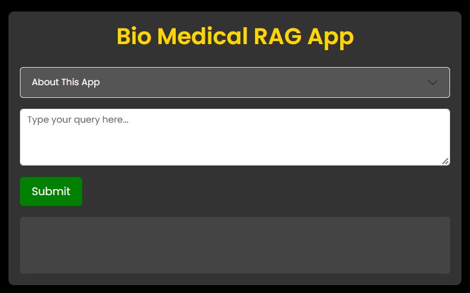
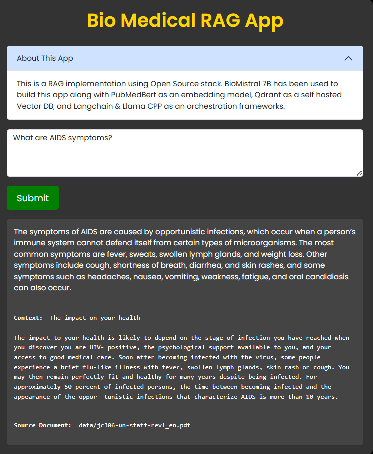

# Medical RAG Application with BioMistral and ChromaDB

A Retrieval Augmented Generation (RAG) implementation using an open-source stack, featuring cniongolo\biomistral through Ollama, PubMedBERT embeddings, and ChromaDB as the vector database.

## Tech Stack

- **Large Language Model**: cniongolo/biomistral (via Ollama)
- **Embeddings**: PubMedBERT (NeuML/pubmedbert-base-embeddings)
- **Vector Database**: ChromaDB
- **Backend Framework**: FastAPI
- **Frontend**: Bootstrap 5.3
- **Orchestration**: LangChain

## Features

- Medical domain-specific question answering using BioMistral 7B
- Document retrieval using PubMedBERT embeddings for accurate medical context matching
- Persistent vector storage with ChromaDB
- Modern, responsive web interface
- Asynchronous request handling with timeout protection
- Detailed logging for monitoring and debugging

## Prerequisites

- Python 3.7+
- Ollama installed with BioMistral model
- Sufficient storage for ChromaDB and model files

## Installation

1. Clone the repository:

```bash
git clone https://github.com/BlakeAmory/medical_rag_biomistral.git
cd medical_rag_biomistral
```


2. Install dependencies:

```bash
pip install -r requirements.txt
```

3. Prepare your documents:
   - Place your PDF documents in the `data/` directory

4. Initialize the vector database:

```bash
python ingest.py
```


5. Start the application:

```bash
uvicorn app:app --reload
```


## Usage

1. Access the web interface at `http://localhost:8000`
2. Enter your medical query in the text area
3. Click "Submit" to get a detailed response based on the available medical documentation

## Interface Screenshots

### Main Interface

*The main application interface with query input and response area*

### Source Context

*The application shows the source context used for generating the response*

## Project Structure

- `app.py`: Main FastAPI application
- `ingest.py`: Document ingestion script for ChromaDB
- `templates/`: Frontend HTML templates
- `data/`: Directory for source PDF documents
- `chroma_db/`: ChromaDB persistence directory

## License

Distributed under the MIT License. See `LICENSE` for more information.
